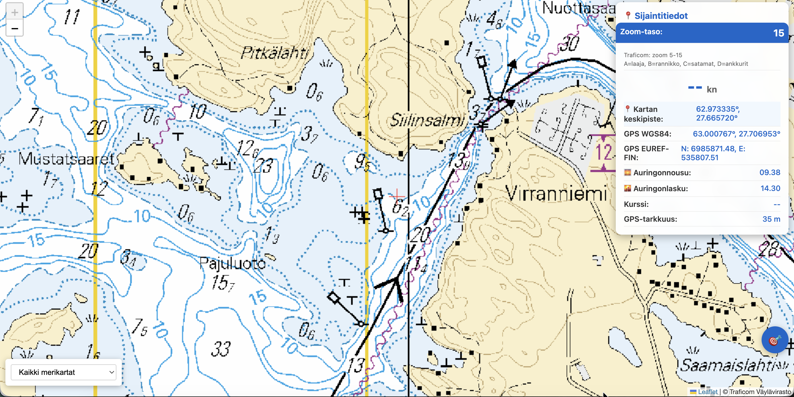

# WebMuikku - Merikarttasovellus kalastajille

Web-pohjainen merikarttasovellus, joka näyttää Traficomin viralliset merikartat GPS-paikannuksen kanssa. Suunniteltu erityisesti kalastajien ja veneilijöiden tarpeisiin.


*WebMuikku käyttöliittymä - Merikartta GPS-paikannuksen kanssa*

## Ominaisuudet

### 🗺️ Kartat
- **42 eri karttatasoa** Traficomin WMTS-palvelusta
- Veneilykartat, rannikkokartat ja satamakartat
- Yksittäiset sarjat A-V
- Yleiskartat 1:100k ja 1:250k
- Vaihtoehtoina OpenStreetMap ja OpenSeaMap

### 📍 GPS ja paikannus
- Reaaliaikainen GPS-seuranta
- Automaattinen kartan keskitys
- Nopeus solmuina (kn)
- Kurssi ja suunta
- GPS-tarkkuuden näyttö

### 📊 Tiedot
- **WGS84-koordinaatit** (desimaaliasteet)
- **EUREF-FIN koordinaatit** (ETRS-TM35FIN)
- Auringonnousu ja -laskuajat
- Liikkumisnopeus
- Zoom-taso ja kartan keskipiste

### 🎯 Käyttöliittymä
- **Yksinkertainen 🎯-nappi:**
  - Yksi klikkaus = Keskitä kartta GPS-sijaintiin
  - Tuplaklikkaus = Automaattinen seuranta päälle/pois
- Karttatasojen vaihto helposti
- Optimoitu kosketusnäytöille
- Näytön päälle jääminen (Wake Lock API)

## Asennus

### Vaatimukset
- Node.js 14+ (proxy-palvelimelle)
- Moderni selain (Chrome, Firefox, Safari, Edge)
- HTTPS tai localhost (GPS toimii vain turvallisessa yhteydessä)

### 1. Kloonaa repository
```bash
git clone https://github.com/trotor/webmuikku.git
cd webmuikku
```

### 2. Käynnistä proxy-palvelin
```bash
npm start
# tai suoraan:
node utils/proxy-server.js
```

Proxy-palvelin käynnistyy portissa 3000 ja välittää WMTS-pyynnöt Traficomille.

### 3. Avaa sovellus selaimessa

**Paikallisesti:**
```bash
# Python 3
python3 -m http.server 8000

# Tai avaa suoraan
open index.html
```

Sitten avaa: `http://localhost:8000`

**HTTPS tarvitaan GPS:lle tuotannossa!**

## Käyttö

### Veneessä
1. Avaa sovellus puhelimessa tai tabletissa
2. Salli GPS-paikannus
3. Kartta näyttää sijaintisi automaattisesti
4. Vaihda karttatasoa alavalikosta
5. Klikkaa 🎯 keskittääksesi kartan
6. Tuplaklikkaa 🎯 ottaaksesi automaattisen seurannan pois päältä

### Karttatasot

**Suositus kalastajille:**
- **Veneilykartat** - Paras kokonaisnäkymä
- **Rannikkokartat** - Yksityiskohtaiset rannikkoalueet
- **Satamakartat** - Satamiin saapuminen
- **Kaikki merikartat** - Kaikki tasot yhdessä (oletus)

**Yksittäiset sarjat:**
- A-V sarjat eri alueille ja tarkkuuksille

## Tekninen toteutus

### Arkkitehtuuri
```
┌─────────────┐
│  Selain     │
│  (Leaflet)  │
└──────┬──────┘
       │
       ▼
┌─────────────┐      ┌──────────────┐
│ Proxy       │─────▶│  Traficom    │
│ (Node.js)   │      │  WMTS API    │
└─────────────┘      └──────────────┘
```

### Teknologiat
- **Leaflet.js** - Karttakirjasto
- **Proj4.js** - Koordinaattimuunnokset
- **SunCalc.js** - Auringon nousu/lasku
- **Node.js** - Proxy-palvelin CORS-ongelmien kiertämiseen

### CORS-ratkaisu
Traficomin WMTS-palvelu estää suoran selainkäytön (ORB-suojaus). Proxy-palvelin välittää pyynnöt ja lisää CORS-headerit.

## Tiedostorakenne

```
webmuikku/
├── index.html           # Pääsovellus
├── utils/
│   └── proxy-server.js  # Node.js proxy WMTS:lle
├── screenshots/
│   └── webmuikku-app-screenshot.png  # Sovelluksen kuvakaappaus
├── README.md            # Tämä dokumentti
├── CHANGELOG.md         # Versiohistoria
├── package.json         # Projektin metadata
├── LICENSE              # MIT-lisenssi
└── .gitignore           # Git-ohitukset
```

## Kehitys

### Proxy-palvelimen muokkaus
Proxy-palvelin on `utils/proxy-server.js`. Se välittää WMTS-pyynnöt Traficomille.

**URL-rakenne:**
```
http://localhost:3000?layer=Traficom:Merikarttasarja%20A%20public&z=10&x=582&y=296
```

### Karttatasojen lisääminen
Muokkaa `index.html` tiedostossa `wmtsLayers`-objektia:

```javascript
const wmtsLayers = {
    'uusi_taso': 'Traficom:Uusi Taso Nimi',
    // ...
};
```

Lisää vaihtoehto `<select>`-elementtiin:
```html
<option value="uusi_taso">Uusi Taso</option>
```

## Lisenssi

MIT License - Vapaa käyttö, muokkaus ja jakelu.

## Tekijät

- Tero Ronkko - Alkuperäinen kehitys
- Claude (Anthropic) - Kehitysapu

## Kiitokset

- **Traficom** - Merikarttojen tarjoaminen WMTS-palveluna
- **OpenStreetMap** - Taustakartat
- **OpenSeaMap** - Merikarttatiedot

## Tuki

Ongelmat ja ehdotukset: [GitHub Issues](https://github.com/trotor/webmuikku/issues)

## Changelog

Katso [CHANGELOG.md](CHANGELOG.md)

---

**Huom:** Tämä sovellus on suunniteltu navigoinnin apuvälineeksi. Käytä aina virallisia merikarttoja ja navigointivälineitä turvallisen veneilyn varmistamiseksi.
