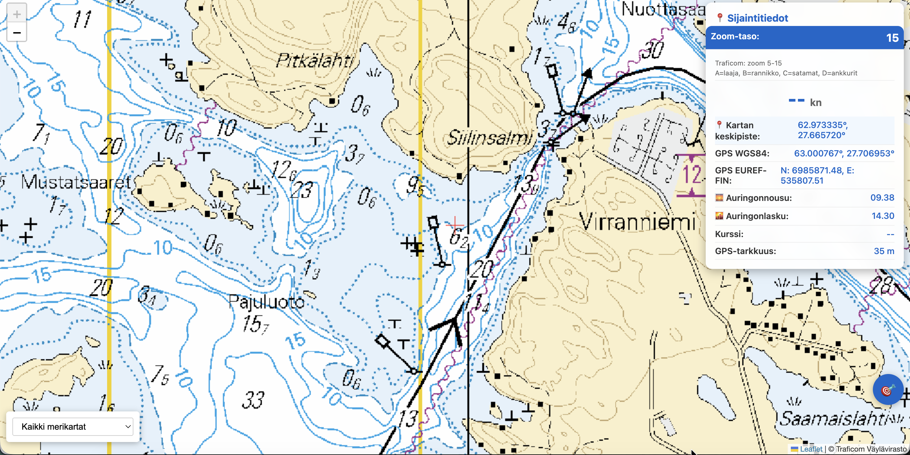

# WebMuikku - Merikarttasovellus kalastajille

Web-pohjainen merikarttasovellus, joka näyttää Traficomin viralliset merikartat GPS-paikannuksen kanssa. Suunniteltu erityisesti kalastajien ja veneilijöiden tarpeisiin.

**Demo:** [muikku.muikea.fi](https://muikku.muikea.fi)


*WebMuikku käyttöliittymä - Merikartta GPS-paikannuksen kanssa*

## Ominaisuudet

### Kartat
- Traficomin viralliset merikartat (Merikarttasarjat) WMTS-palvelusta
- OpenStreetMap taustakarttana

### GPS ja paikannus
- Reaaliaikainen GPS-seuranta
- Automaattinen kartan keskitys (toggle)
- Nopeus solmuina (kn)
- Kurssi ja suunta
- GPS-tarkkuuden näyttö

### Tiedot
- **WGS84-koordinaatit** (desimaaliasteet)
- **EUREF-FIN koordinaatit** (ETRS-TM35FIN)
- Kartan keskipisteen koordinaatit
- Auringonnousu ja -laskuajat
- Zoom-taso

### Käyttöliittymä
- **Infopalkki** (oikea yläkulma): piilotettavissa/näytettävissä klikkaamalla headeriä
- **Keskitä-nappi:** klikkaus = keskitä GPS-sijaintiin, tuplaklikkaus = seuranta päälle/pois
- **Koko näyttö -nappi**
- Mobiilioptimoitu: safe area -tuki, auto-collapse, landscape-tila
- Näytön päälle jääminen (Wake Lock API)

## Asennus

### Vaatimukset
- Moderni selain (Chrome, Firefox, Safari, Edge)
- HTTPS tai localhost (GPS toimii vain turvallisessa yhteydessä)

### Paikallinen kehitys
```bash
git clone https://github.com/trotor/webmuikku.git
cd webmuikku
python3 -m http.server 8000
```
Avaa: `http://localhost:8000`

## Tekninen toteutus

### Arkkitehtuuri
```
┌─────────────┐
│  Selain     │
│  (Leaflet)  │
└──────┬──────┘
       │
       ▼
┌──────────────┐
│  Traficom    │
│  WMTS API    │
└──────────────┘
```

### Teknologiat
- **Leaflet.js** - Karttakirjasto
- **Proj4.js** - Koordinaattimuunnokset (WGS84 ↔ EUREF-FIN)
- **SunCalc.js** - Auringon nousu/lasku
- **Traficom WMTS** - Viralliset merikartat

### Rakenne
Koko sovellus on yhdessä `index.html`-tiedostossa (HTML + CSS + JavaScript). Ei build-steppiä, ei npm-riippuvuuksia.

## Deployment

Push `main`-branchiin käynnistää automaattisen deploymentin GitHub Actionsin kautta palvelimelle muikku.muikea.fi. Katso [DEPLOYMENT.md](DEPLOYMENT.md).

## Lisenssi

MIT License - Vapaa käyttö, muokkaus ja jakelu.

## Tekijät

- Tero Ronkko - Alkuperäinen kehitys
- Claude (Anthropic) - Kehitysapu

## Kiitokset

- **Traficom** - Merikarttojen tarjoaminen WMTS-palveluna
- **OpenStreetMap** - Taustakartat

## Tuki

Ongelmat ja ehdotukset: [GitHub Issues](https://github.com/trotor/webmuikku/issues)

---

**Huom:** Tämä sovellus on suunniteltu navigoinnin apuvälineeksi. Käytä aina virallisia merikarttoja ja navigointivälineitä turvallisen veneilyn varmistamiseksi.
